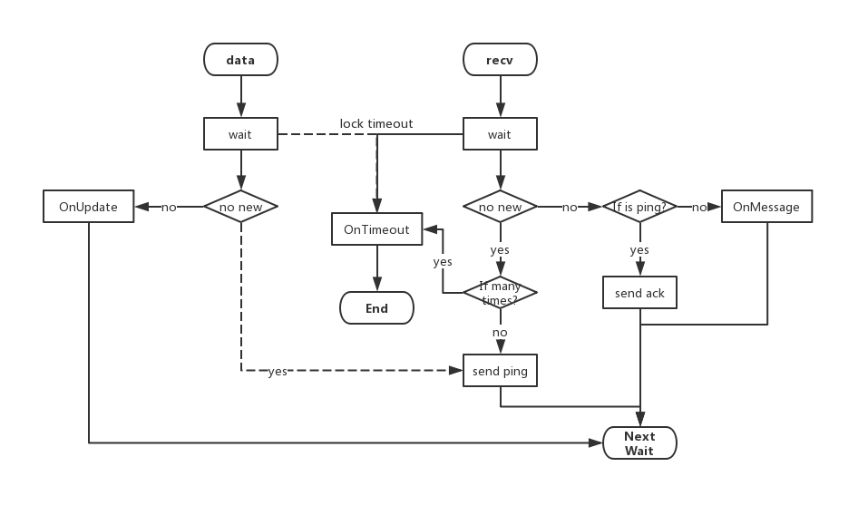

## LSM技术手册

---

### 1. 概述

LSM，全称为Lightweight Shared Memory Communications and Marshalling，也即是一个轻量级的共享内存通信库，为了解决大规模数据在几个进程节点间交换的效率问题而提出的。

有别于一般的跨进程使用UDP或TCP方式，LSM直接将数据存放在一段共享内存处，其他接收方仅需要直接从该段内存读取即可。

目前LSM通过Boost.Interprocess实现，为了解决其存在的主从关系，LSM实现分成两部分：服务端与客户端。服务端，也可以认为是驱动，维护着所有内存的创建、销毁，以及客户端的连入、断开；客户端，也即应用程序，通过简单的使用接口，连入驱动管理，发起信道建立、断开等请求，进行数据交换。

LSM驱动部分是一个可执行程序，可随系统启动而启动；LSM客户端是一个开发库，可由应用程序开发者链接使用。

### 2. 系统设计

LSM运作时整体结构如下图所示：

其中，黑色无箭头实线代表着 **连接（Connection）**，黑色有箭头实线代表着 **竞争读写接口（Race IO）**，虚线圆圈代表着 **逻辑内存区域（Logical Memory Block）**，虚线圆圈中的每个图形都代表着**内存区域（Memory Block）**。

可以看到，LSM系统中一共存在三个逻辑内存区域：**公共区域（Public Area）**、**私有区域（Private Area）**和 **交换区域（Swap Area）**。这三个区域分别代表了LSM运作的三个过程，其中在公共区域执行着新客户端连入驱动管理的步骤，只有该步骤是没有上锁的，称之为**竞争进入**。在私有区域内执行着客户端与驱动端的事件互动，如接入信道、断开连接等；在交换区域则执行着真正的数据交换。在后两者驱动有一个叫**keepalive**的机制，用以无人问津某个内存区域时，将其回收。

下面将详细介绍这三个逻辑区域的工作原理。

### 3. 竞争进入

LSM作为一个C/S模型的系统，在驱动端总会有一个公共的接入入口，这就是公共区域。与其他数据交换不同，客户端接入驱动管理交换的数据量小，操作相对原子，又比较高速，牵连的客户端数量最多，因此不便于使用同步的方法。而且如果同步过程中，获得资源的客户端异常退出，将会导致所有准备进入的客户端一起超时等待。为了解决这个问题，我设计了一个称之为**竞争进入（Race In）**的机制，在不使用锁的情况下，将客户端一一接入到驱动管理中来。

竞争进入的核心在于不断尝试，其分为三个阶段：

- **抢注阶段（Cybersquatting）**所有客户端异步地通知驱动，自己想要连接进来（多写一读）；
- **准入阶段（Admittance）**某个时刻下，驱动阅读了通知，其中一个客户端的写入被承认，驱动将该客户端的信息填写在另一个字段处，此时所有客户端也同时在异步阅读该字段（一写多读）；
- **确认阶段（Acknowledge）**由于客户端的信息是全局唯一的，因此只有一个经历了抢注阶段的客户端被准入，其再次反馈相同的信息给驱动，驱动阅读后，若该信息与准入信息相同，则完成确认，同时为该客户端建立私有区域。（一写一读）

该步骤的流程如下图所示：

在该步骤中，最为关键的部分是，如何为客户端分配唯一的X。不难想象到，每一个应用程序而言，可以以PID作为其唯一标识，而在一个程序内，每一个客户端实例可以由客户端的一个全局静态计数器再进行区分。总而言之，全局唯一的条件是可以达到的。

### 4. 连接管道

在介绍LSM的管理机制之前，需要先介绍一下LSM通过共享内存区域进行数据交换的基本原理。

使用Boost.Interprocess创建的共享内存区域，理论上任何进程都是可以访问到的，因此为了防止别名现象，驱动端启动时要求带一个名字，用以该驱动以及其客户端创建共享内存区域时的公共前缀，而另外三个逻辑区域，又分别再加带三个不同的前缀。考虑到扩展性，驱动端启动时的名字和客户端构造时的名字都是可以自定义的。

刚才也提到了，共享内存只要知其名，谁都可以访问到，而其内容是否正确，则只能由各个客户端各自进行判断。因此与其说这是一种连接，我更想说它是一个管道，谁都可以从其中读写东西。因此事实上，LSM虽然已经采取各种方法使得每一对C/S之间，或者数据交换关系中的内存区域名字不同，但是若碰巧有相同名字的连接产生，也不会破坏LSM内在的管理逻辑。

这个特性并不是被设计出来的，而是它本来就有，当我在做一些测试的时候才发现这么一种现象。幸运的是，它不会破坏LSM的逻辑，相反，这个特性也提供了某种潜在的使用方式，待我们后期慢慢开发。

### 5. 管理机制

目前LSM的管理机制相对简单，报文只有简单几种：**连接进入（Link In）**、**连接退出（Link Out）**、**测活（Ping）**、**断开驱动管理（Goodbye）**、**确认（ACK）**等，但对于目前我的需求却也已经够用。考虑到扩展性，代码中都预留相关接口可以二次开发，若之后有需要再丰富LSM的协议。

以上所说的报文交换以及数据交换，均发生在**连接（Connection）**中（见第一个图），事实上，报文交换是一种特殊的数据交换。一个连接中，存在三个数据交换字段，一个用于发送报文，一个用于接收报文，一个用于用户数据交换。设计两个端口用于报文交换，是因为考虑到读写方不一定同步进行。除此之外，报文交换中除了附带报文信息，还带有一个**头部（Header）**，用于描述本报文的类别，以及其回复的历史报文类别，用于区别管理。

由于共享内存的机制比较底层，没有现成方法告诉读者哪些数据是旧的，哪些是刚刚更新，因此为了解决这个问题，每一个数据前头又带一个头部，目前该头部仅包含一个只会递增的字节，用作标识更新与否的报文ID。

连接的内存区域设计示意如下图所示：

每一个连接均维护着两个监听线程，分别监听recv字段与data字段的更新，send字段的使用发生在recv字段的回复，或者是用户线程的行为调用，data字段的发送发生在用户线程，而接收则以回调的形式通知用户。字段的读写操作均是同步的。

重新看回第一个图可知，每一个客户端（client）均与驱动端（server，或driver）保持着一个连接，用于大部分控制信息的交换，而客户端与客户端建立的数据交换中，驱动端都会从中插一脚，用以**keep alive机制**，事实上所有连接都有该机制维护着内存区域的生命周期。

连接的监听逻辑设计如下图所示：

其中，ping作为keep alive机制的控制报文，用以探测该连接是否有人使用，它的ack回复是自动的。图中与data相关的部分逻辑使用虚线箭头，表示该逻辑嫁接在recv线程中得以实现。该连接维护的逻辑中，共有三个回调接口，分别是：

- OnUpdate：用户数据更新回调，只会发生在收到别的客户端发来信息的时候。
- OnMessage：报文更新回调，该回调目前由LSM管理，是作为LSM系统的一部分存在。
- OnTimeout：内存区域长时间未更新，或者客户端异常退出而发生死锁时回调，此时作为客户端会主动断开连接，而驱动端则会回收这片内存区域，目前没有重连接机制，需要LSM客户端使用者自行开发。

以上就是所有的管理机制，就如我所说，这样已经足够满足当前数据交换的需求了，至于进一步的需求，如重连接、数据序列化、数据加密等要求，可以通过另外一套框架来进行实现（详见nox设计）。

### 6. 程序设计

LSM依赖Boost.Interprocess，目前仅在Ubuntu下试验过，代码开源在：https://github.com/Yarten/LSM，欢迎各位下载使用，并且再次开发，以及提供宝贵的改进意见。

代码的设计基本分为5个逻辑部分：

- kernel：核心部分，包括内存操作的基本类，若之后改换其他共享内存操作库，改变最多便是该模块；
- component：组件部分，包括着LSM管理机制所需要的所有类，二次开发LSM协议便是该部分的工作；
- server：服务端，或驱动端的实现，该部分产生一个可执行文件；
- client：客户端，用于连接驱动、数据交换等操作，给应用程序使用LSM的接口；
- utils：其他一些常用工具函数；

